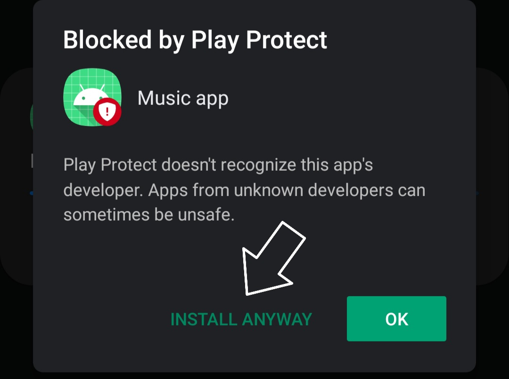

<h1 align="center">Reworked musical tesla coil</h1>  

<h2>Description:</h2>
Reworked musical tesla coil in smaller scaling. Using an application with which we choose a song and send it to the coil interrupter. 
We will have 2 applications for mobile android phones – one complete mp3 player, that play/pause songs and all that trivial operations. Second – app that list all “.wav” files and than with holding chosen song – it will arrive new dialog window that asks the user if he want to send it via Bluetooth to the interrupter or cancel that operation. 
Then the interrupter sends out modified pulses which interrupt the coil supply so that the output to the coil has the same frequency as the audio signal. 
The software for the interrupter will wait for upload command, after which the program reads the byte sequence and stores it in an external flash memory. If a play command is sent the program reads the content of that memory and converts it into respective PWM(Pulse Width Modulation) signal.
  

## How to install (only for android)
With your android phone follow this <a href="https://drive.google.com/drive/folders/1HosFVmRzxvioICeHo3vdVdEkMbiyzbBV?usp=sharing">link</a>. Start the installation by choosing with what to open current file. Then click install. 
 
 \
Play protect, or your google api service may recognize it as virus but don't worry - just install!  

After the installation is completed, you will see new icon with name "Music app". That's it! \

  

## Technologies:
1. Java 
2. XML 
3. C / C++ 
4. Embedded
 
   

## Management:
>Branching Strategy – [GitHub Flow](https://guides.github.com/introduction/flow/)

>>Our modification of this model will be that before pull request with master branch - a new branch developer must be created. In this branch, the pull requests are made to interconnected code (at the same time code reviews are made), which is previously divided into other branches. Then, before pulling a request from the developer to the master branch, you need to review the whole new feature.  
***"Talk is cheap. Show me the code."***

 

>Strategy of development - Kanban

  

## Authors: Stoyan Tinchev and Alexandar Alexandrov

